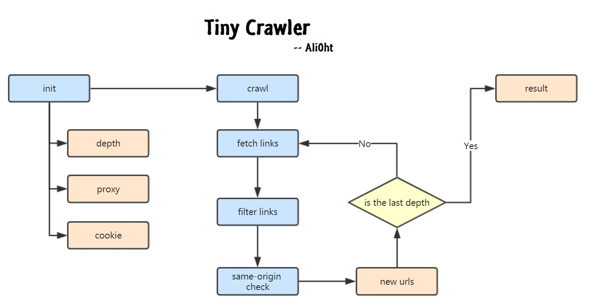
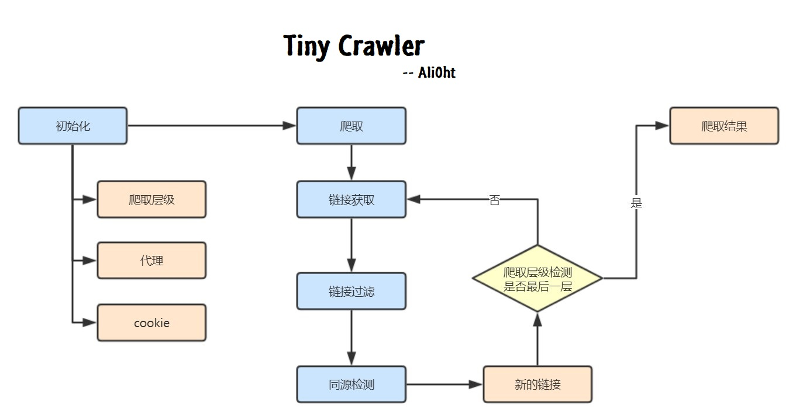
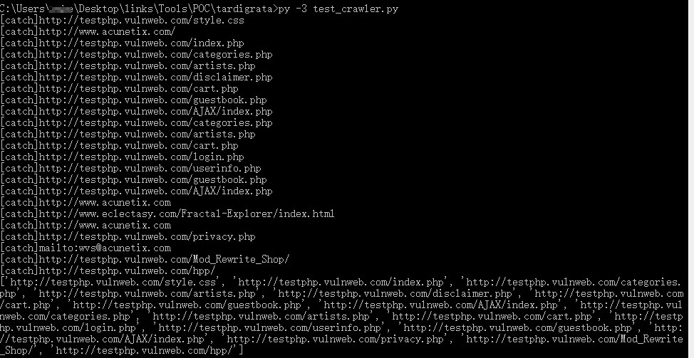
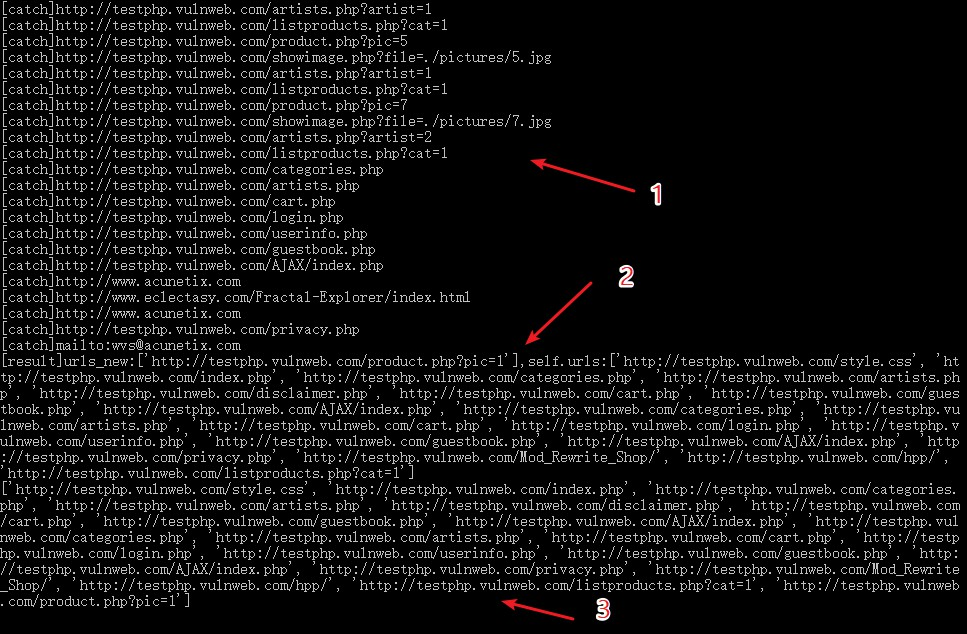
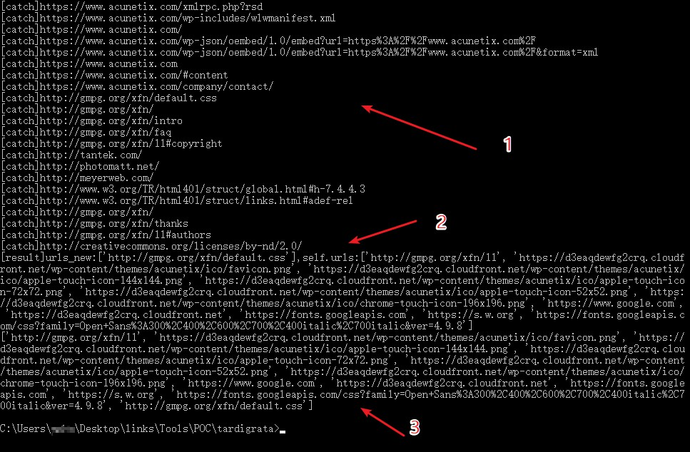
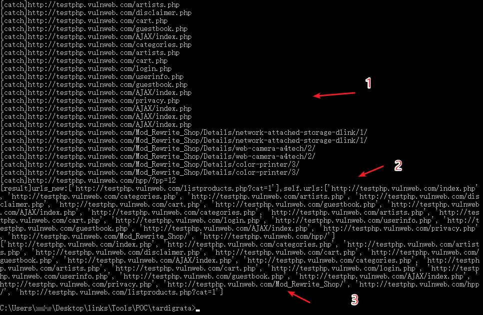
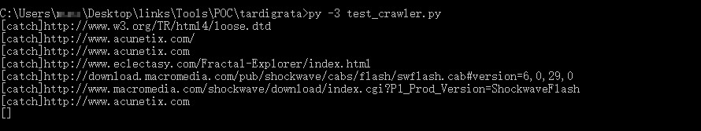

# tinycrawler

`Tiny Crawler` is an easy crawler python class file written in 150 lines. And it can fix to daily pentest work due to it's multifunction.

Author: Ali0th

Email: martin2877@foxmail.com

Date: 20181104

## 简介

`Tiny Crawler`是一个 150 行代码实现的简单爬虫，是一个 python class 文件。它能够应付日常的渗透测试工作，因为它具备多种功能。

代码的写法上，尽量让代码量少而精、通用、易用，以便于实现日常的大量爬虫需求。可以随时集成到其它工具当中。

代码地址：<https://github.com/Martin2877/tinycrawler>

语言： python3

行数：去掉注释内部约150行

## 功能模块





## 用法示例

### 0 最基本用法

直接两步，一步是初始化实例，一步是爬取，最后便可以通过实例中的 `urls` 变量看到爬取结果。默认为爬取深度为1的同源地址。

```python
def testphp_vulnweb():
    url = "http://testphp.vulnweb.com/"
    webcrawler = Webcrawler(url)
    webcrawler.crawl()
    urls = webcrawler.urls
    print(urls)
```



### 1 实现深度爬取

```python
def testphp_vulnweb():
    url = "http://testphp.vulnweb.com/"
    webcrawler = Webcrawler(url,3)
    webcrawler.crawl()
    urls = webcrawler.urls
    print(urls)
```



可以看到，爬取的是同源的地址链接，并且对每个新的地址进行爬取，直到达到设定的层级深度为止。

### 2 实现广度爬取

```python
def testphp_vulnweb():
    url = "https://www.acunetix.com/"
    webcrawler = Webcrawler(url,2)
    webcrawler.crawl(None,False,None,True)
    urls = webcrawler.urls
    print(urls)
```



可以看到，所有非同源的地址被爬取了出来。并且也是对每个新的地址进行爬取，直到达到设定的层级广度为止。

### 3 复杂功能

1. 代理
2. 设置cookie
3. 链接匹配
4. 设定爬取数量
5. 以正则的方式获取链接

这些不一一介绍，下面以爬取的示例展示

```python
def testphp_vulnweb():
    cookie = {
        'Proxy-Connection' : 'keep-alive',
        'Cache-Control' : 'max-age=0',
        'Upgrade-Insecure-Requests' : '1',
        'User-Agent' : 'Mozilla/5.0 (Windows NT 10.0; Win64; x64) AppleWebKit/537.36 (KHTML, like Gecko) Chrome/69.0.3497.100 Safari/537.36',
        'Accept' : 'text/html,application/xhtml+xml,application/xml;q=0.9,image/webp,image/apng,*/*;q=0.8',
        'Referer' : 'https://www.google.com.hk/',
        'Accept-Encoding' : 'gzip, deflate',
        'Accept-Language' : 'zh-CN,zh;q=0.9'
    }
    url = "http://testphp.vulnweb.com/"
    webcrawler = Webcrawler(url,2,"http://127.0.0.1:8081",cookie)
    match = {"css":False,"php":True} # 过滤含 css 的链接，但要 php 的
    webcrawler.crawl(match,True,100,None,None)
    # 分别意思为：
    # 使用match过滤，同源，最多获取 100 个链接，不找新域名，爬取 html 标签
    urls = webcrawler.urls
    print(urls)
```



有时候，链接写在 js 中，而不是放在 html 的中，这个时候，就要通过正则的形式去获取。如上面的代码修改成下面的形式。

```python
webcrawler.crawl(None,True,100,None,"regex")
```



结果可以看到爬取到以匹配形式获取的链接。

## 案例 : 目录遍历

只要引用此模块便可快速爬取目录遍历的所有链接。

```python
from crawler import Webcrawler

def fetch(_url):
    webcrawler = Webcrawler(_url,5)
    webcrawler.crawl()
    print(webcrawler.urls)
```

## TODO

因为平时还会有一些其它的需求，比如爬取时候，同一类型的相似地址爬取过多，或要根据页面内容来过滤链接等，所以本爬虫还在不断改进中。

- [ ] 内容爬虫
- [ ] 通过页面内容过滤链接
- [ ] 根据页面内容匹配去重

## 一些装逼型的代码写法

为了将代码量和行数缩减到最少，脚本中包含了大量装逼型代码写法，下面罗列一些，仅供欣赏。

1、检查已经存在的url

```python
        # check for exist url
        source = self.urls if self.new_domain else self.website
        return [x for x in _urls if x not in self.urls and comp_netloc(x,source)]
```

装逼写法有三，使用了 `x if a else b` `x for x in` 和 
加`[]`返回list。

2、循环爬取

```python
        for dp in range(1,self.depth):
            urls_new = self.comp(set(self.flat_list(list(map(self.url_html,urls_new)))))
            if len(urls_new) == 0:break
            if verbose : print("[result]urls_new:{0},self.urls:{1}".format(urls_new,self.urls))
            self.urls.extend(urls_new)
```

装逼写法为这里使用 `for` 进行循环爬取的加载，当新地址为 0 时才退出。而新地址 `urls_new` 使用了上面封装的`self.comp`方法进行比较提取。

## MyBlog

CSDN <https://blog.csdn.net/u013661799>

掘金 <https://juejin.im/user/58170ea05bbb500059af1da0>